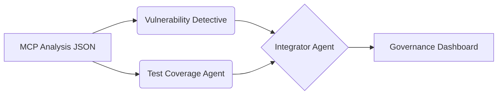

# Skills Overview

This document describes the "Skills Pack v1" for `repo-intel-bundle-v2`. These skills are implemented as autonomous agents that consume the static analysis outputs.

## Agent Architecture

## Available Skills

| Skill | Description | Output |
| :--- | :--- | :--- |
| **Vulnerability Detective** | Security posture analysis, identifying secrets and misconfigurations. | `*.vuln_detective.md` |
| **Test Coverage** | Test maturity assessment and QA strategy generation. | `*.test_coverage.md` |
| **Integrator Governance** | Portfolio-level aggregation and roadmap planning. | `governance_summary.md` |

## Execution

Scripts are located in `agents/` and can be run via the `Makefile`.
