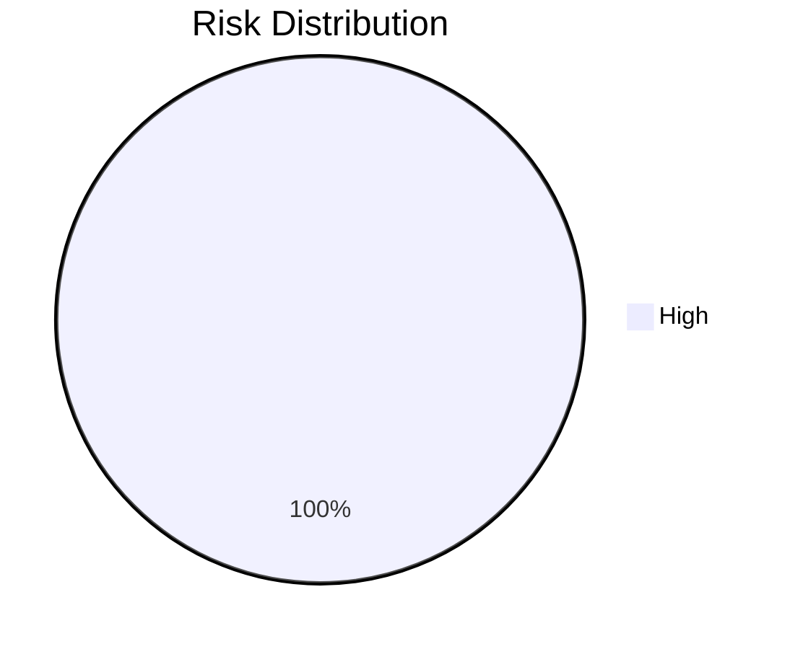

# Governance Report: 
**Date:** 2026-02-16T18:16:33.653616
**Repos Analyzed:** 1
**Portfolio Health (Avg Quality):** 75.0/100

## Portfolio Dashboard
| Repository | Quality | Cloud | Risk | Security Score | Test Maturity |
| :--- | :--- | :--- | :--- | :--- | :--- |
| example/dummy | 75 | 40 | 60 | 50 | Medium |

## Strategic Roadmap
### Phase 1: Risk Remediation
- [ ] Fix critical security issues in **example/dummy**
### Phase 2: Standardization
- All repos have basic testing infrastructure.

## Visualizations
