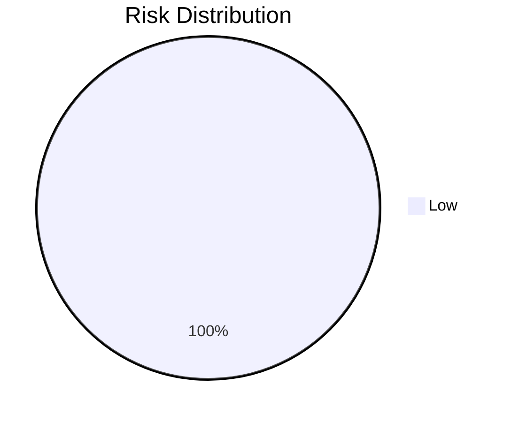

# Governance Report: jmgp_audit
**Date:** 2026-02-16T21:16:28.761295
**Repos Analyzed:** 2
**Portfolio Health (Avg Quality):** 67.5/100

## Portfolio Dashboard
| Repository | Quality | Cloud | Risk | Security Score | Test Maturity |
| :--- | :--- | :--- | :--- | :--- | :--- |
| pallets/flask | 75 | 30 | 20 | 95 | Medium |
| jgraph/drawio-mcp | 60 | 30 | 40 | 95 | Low |

## Strategic Roadmap
### Phase 1: Risk Remediation
- No critical risks detected.
### Phase 2: Standardization
- [ ] Implement CI and basic tests for **jgraph/drawio-mcp**

## Visualizations
